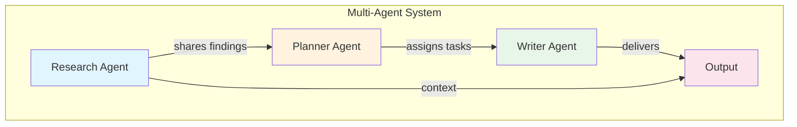

import { Card, CardGroup } from '@site/src/components/Card';
import { ArchitectureDiagram } from '@site/src/components/ArchitectureDiagram';

# Introduction to Multi-Agent AI Systems

**Learning Objectives:**

- Define what a multi-agent system is
- Explain the benefits of using multiple agents
- Identify real-world problems multi-agent systems can solve

## What Are Multi-Agent Systems?

A multi-agent system (MAS) is a collection of autonomous AI agents that work together to achieve goals they couldn't accomplish alone. Each agent is an independent entity that can perceive its environment, make decisions, and take actions.

Think of it like a well-organized team:



**Key characteristics of agents:**

| Characteristic | Description |
|----------------|-------------|
| **Autonomous** | Each agent operates independently without constant human intervention |
| **Goal-oriented** | Agents work toward specific objectives |
| **Communicative** | Agents share information and coordinate with each other |
| **Adaptive** | Agents can adjust their behavior based on feedback |

## Why Use Multi-Agent Systems?

Multi-agent systems solve problems that are too complex for a single agent:

### Benefits

1. **Scalability**: Add specialized agents as tasks grow more complex
2. **Specialization**: Each agent excels at a specific task
3. **Collaboration**: Agents share context and build on each other's work
4. **Robustness**: System continues working even if one agent fails

### Real-World Applications

| Domain | Application | Agents Involved |
|--------|-------------|-----------------|
| **Content Creation** | Research, plan, and write articles | Researcher, Planner, Writer |
| **Customer Support** | Triage, resolve, escalate issues | Triage, Resolution, Escalation |
| **Software Development** | Design, code, test, review | Architect, Coder, Tester, Reviewer |
| **Research & Analysis** | Gather, analyze, synthesize information | Researcher, Analyst, Synthesizer |

## Single Agent vs. Multi-Agent

```mermaid
flowchart LR
    subgraph "Single Agent"
        S1[Single large model handles everything]
    end

    subgraph "Multi-Agent"
        M1[Specialized Agent 1]
        M2[Specialized Agent 2]
        M3[Specialized Agent 3]
        M1 --> M2 --> M3
    end

    S1 --- "Complex, monolithic task" --- M1
```

| Aspect | Single Agent | Multi-Agent |
|--------|--------------|-------------|
| **Complexity** | All tasks in one model | Distributed across specialists |
| **Specialization** | General-purpose | Each agent excels at one task |
| **Debugging** | Hard to isolate issues | Easier to identify problematic agent |
| **Scaling** | Requires larger model | Add more agents |
| **Cost Control** | One expensive API call | Multiple cheaper calls |

## Chapter Overview

This chapter covers:

1. **Agent Architectures** - Common patterns for organizing agents
2. **Working Example** - A complete, runnable multi-agent system
3. **Best Practices** - Guidelines for effective multi-agent design

## Quick Check

Before proceeding, verify your understanding:

- [ ] Can you explain what a multi-agent system is?
- [ ] Can you name 2 benefits of using multiple agents?
- [ ] Can you identify a problem in your work that might benefit from a multi-agent approach?

---

**Next:** [Understanding Agent Architectures](./architectures) →
