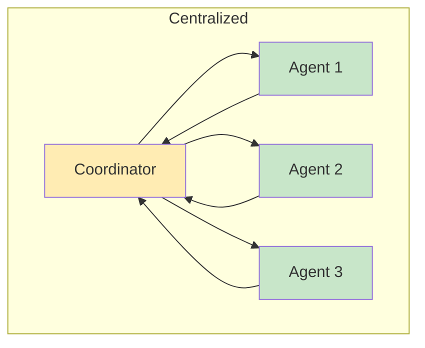
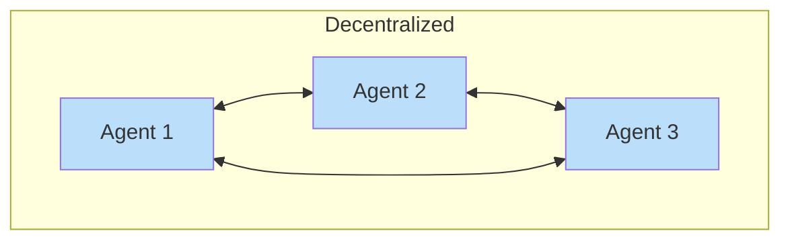
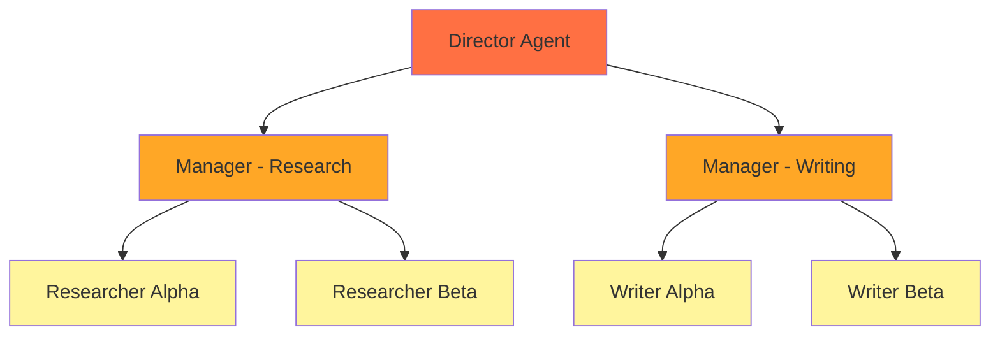
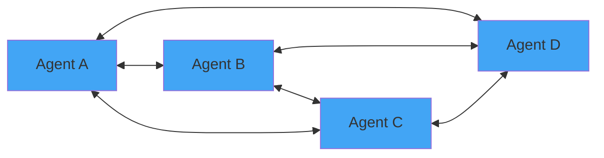
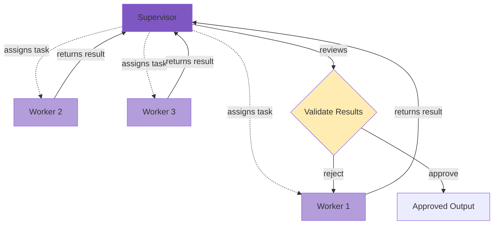
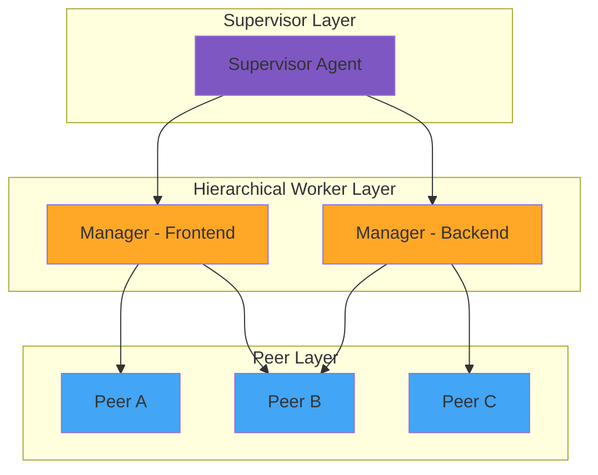

import { ArchitectureDiagram } from '@site/src/components/ArchitectureDiagram';

# Understanding Agent Architectures

**Learning Objectives:**

- Describe the difference between centralized and decentralized coordination
- Identify common architectural patterns (hierarchical, peer-to-peer, supervisor-worker)
- Choose the appropriate architecture for different use cases

## Coordination Models

Multi-agent systems use different approaches to coordinate agent behavior:

**Centralized Coordination:**
- One coordinator agent directs all other agents
- Clear hierarchy, easier to debug
- Single point of failure risk

**Decentralized Coordination:**
- Agents communicate directly with each other
- More resilient, no single point of failure
- Harder to predict overall system behavior

## Architectural Patterns

### 1. Hierarchical Pattern

Agents form a clear chain of command. Top-level agents direct lower-level agents.

**Best for:** Complex workflows with distinct phases, large teams

### 2. Peer-to-Peer Pattern

All agents are equal and communicate directly. No central coordinator.

**Best for:** Collaborative problem-solving, voting/consensus systems

### 3. Supervisor-Worker Pattern

A supervisor agent manages worker agents, assigning tasks and reviewing results.

**Best for:** Iterative refinement, quality control, task routing

## Choosing an Architecture

| Use Case | Recommended Pattern | Rationale |
|----------|---------------------|-----------|
| Article writing pipeline | Hierarchical | Clear phases: research → outline → write → edit |
| Code review system | Supervisor-Worker | Supervisor routes PRs, workers specialize in areas |
| Debate/synthesis system | Peer-to-Peer | Multiple perspectives need equal voice |
| Customer support | Hybrid | Triage (supervisor) → specialized workers |
| Automated trading | Peer-to-Peer | Fast decisions, no single point of delay |

## Hybrid Architectures

Many real-world systems combine patterns:

**Example hybrid scenario:**
- Supervisor assigns high-level tasks
- Managers coordinate their specialist teams
- Specialists use peer collaboration for complex decisions

## Summary

| Pattern | Coordination | Best For | Trade-off |
|---------|--------------|----------|-----------|
| **Hierarchical** | Centralized (top-down) | Complex workflows | Rigid structure |
| **Peer-to-Peer** | Decentralized | Collaborative tasks | Unpredictable behavior |
| **Supervisor-Worker** | Centralized supervisor | Quality control | Supervisor bottleneck |

---

**Previous:** [Introduction](./introduction) | **Next:** [Working Example](./example) →
