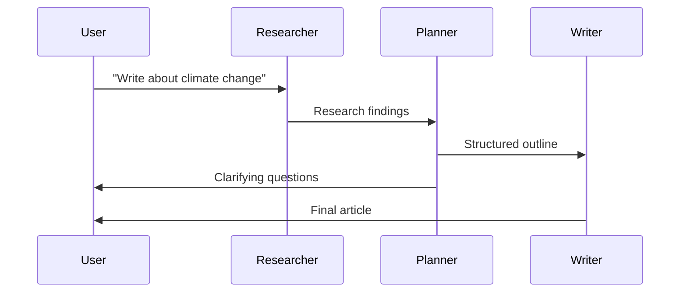
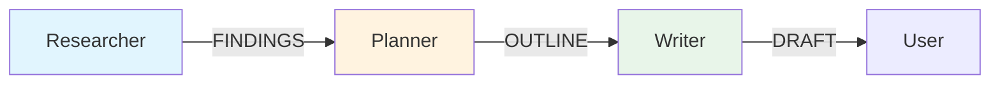

**Learning Objectives:**

- Run a complete multi-agent system
- Understand how agents communicate and coordinate
- Modify the system to add new capabilities

## The Three-Agent Research Team

We'll build a simple multi-agent system where:
1. **Researcher Agent** - Finds information on a topic
2. **Planner Agent** - Organizes findings into a structure
3. **Writer Agent** - Creates the final output



## Prerequisites

Ensure you have Python 3.10+ and the required packages:

```bash
pip install openai pydantic
```

:::info
You'll need an OpenAI API key. Set it as an environment variable:
```bash
export OPENAI_API_KEY="your-api-key"
```
:::

## Complete Code Example

Create a file named `multi_agent_team.py`:

```python
"""
Multi-Agent Research Team
=========================
A simple three-agent system for researching and writing articles.
"""

import os
import json
from dataclasses import dataclass
from typing import List, Optional
from enum import Enum
from openai import OpenAI

# Configuration
os.environ["OPENAI_API_KEY"] = os.getenv("OPENAI_API_KEY", "")
client = OpenAI()

# ============================================================================
# Message Types
# ============================================================================

class MessageType(Enum):
    REQUEST = "request"
    FINDINGS = "findings"
    OUTLINE = "outline"
    DRAFT = "draft"
    FEEDBACK = "feedback"
    COMPLETE = "complete"


@dataclass
class Message:
    """A message sent between agents."""
    sender: str
    recipient: str
    type: MessageType
    content: str
    metadata: Optional[dict] = None


# ============================================================================
# Base Agent Class
# ============================================================================

class Agent:
    """Base class for all agents."""

    def __init__(self, name: str, role: str, goal: str):
        self.name = name
        self.role = role
        self.goal = goal
        self.inbox: List[Message] = []
        self.context: List[str] = []

    def receive(self, message: Message):
        """Receive a message from another agent."""
        self.inbox.append(message)
        self.context.append(f"[{message.sender}]: {message.content}")

    def think(self, prompt: str) -> str:
        """Generate a response using the LLM."""
        system_prompt = f"""
        You are {self.role}.
        Your goal: {self.goal}

        Current context:
        {chr(10).join(self.context[-5:])}  # Last 5 messages
        """

        response = client.chat.completions.create(
            model="gpt-3.5-turbo",
            messages=[
                {"role": "system", "content": system_prompt},
                {"role": "user", "content": prompt}
            ],
            temperature=0.7
        )
        return response.choices[0].message.content

    def send(self, recipient: "Agent", msg_type: MessageType,
             content: str, metadata: Optional[dict] = None):
        """Send a message to another agent."""
        message = Message(
            sender=self.name,
            recipient=recipient.name,
            type=msg_type,
            content=content,
            metadata=metadata
        )
        recipient.receive(message)

    def clear_context(self):
        """Clear conversation history."""
        self.context = []


# ============================================================================
# Specialized Agents
# ============================================================================

class Researcher(Agent):
    """Finds and summarizes information on a topic."""

    def __init__(self):
        super().__init__(
            name="Researcher",
            role="Expert Researcher",
            goal="Find comprehensive, accurate information on the given topic"
        )

    def research(self, topic: str) -> str:
        """Conduct research on the topic."""
        prompt = f"""
        Research the following topic thoroughly:
        Topic: {topic}

        Provide:
        1. Key concepts and definitions
        2. Main approaches or methods
        3. Important considerations
        4. 3-5 credible sources for further reading

        Format your response as a structured summary.
        """
        return self.think(prompt)

    def process(self, topic: str, next_agent: Agent):
        """Main processing loop for the researcher."""
        findings = self.research(topic)
        self.send(next_agent, MessageType.FINDINGS, findings, {"topic": topic})


class Planner(Agent):
    """Organizes research into a structured outline."""

    def __init__(self):
        super().__init__(
            name="Planner",
            role="Strategic Planner",
            goal="Create clear, logical structures for content"
        )

    def plan(self, research_findings: str, topic: str) -> str:
        """Create an outline based on research."""
        prompt = f"""
        Create a detailed outline for an article about:
        Topic: {topic}

        Research findings:
        {research_findings}

        Create a structure with:
        - 3-5 main sections
        - 2-3 subsections per main section
        - Key points for each section

        Output as a JSON object with this format:
        {{
            "title": "Article Title",
            "sections": [
                {{"heading": "Section 1", "points": ["point 1", "point 2"]}}
            ]
        }}
        """
        response = self.think(prompt)
        # Extract JSON from response
        try:
            # Try to parse the entire response as JSON
            return json.loads(response)
        except json.JSONDecodeError:
            # If not valid JSON, wrap in basic structure
            return {"title": topic, "sections": [], "raw": response}

    def process(self, message: Message, next_agent: Agent):
        """Main processing loop for the planner."""
        topic = message.metadata.get("topic", "Unknown Topic")
        outline = self.plan(message.content, topic)
        self.send(next_agent, MessageType.OUTLINE, json.dumps(outline),
                  {"topic": topic})


class Writer(Agent):
    """Creates the final written content."""

    def __init__(self):
        super().__init__(
            name="Writer",
            role="Professional Writer",
            goal="Create clear, engaging content from research and outlines"
        )

    def write(self, outline: str, topic: str) -> str:
        """Write an article based on the outline."""
        prompt = f"""
        Write a comprehensive article about:
        Topic: {topic}

        Follow this structure:
        {outline}

        Requirements:
        - Engaging introduction
        - Clear section headings
        - Substantive paragraphs
        - Logical flow between sections
        - 800-1200 words
        """
        return self.think(prompt)

    def process(self, message: Message) -> str:
        """Main processing loop for the writer."""
        topic = message.metadata.get("topic", "Unknown Topic")
        article = self.write(message.content, topic)
        return article


# ============================================================================
# Multi-Agent System (The Team)
# ============================================================================

class MultiAgentTeam:
    """Orchestrates the multi-agent workflow."""

    def __init__(self):
        self.researcher = Researcher()
        self.planner = Planner()
        self.writer = Writer()
        self.step = 0

    def run(self, topic: str) -> str:
        """Execute the full multi-agent workflow."""
        print(f"\n{'='*60}")
        print(f"MULTI-AGENT TEAM: Research & Write")
        print(f"{'='*60}")
        print(f"Topic: {topic}\n")

        # Step 1: Research
        print(f"Step 1: {self.researcher.name} is researching...")
        self.researcher.process(topic, self.planner)
        self.step += 1

        # Step 2: Plan
        print(f"Step 2: {self.planner.name} is organizing...")
        latest_msg = self.planner.inbox[-1]
        self.planner.process(latest_msg, self.writer)
        self.step += 1

        # Step 3: Write
        print(f"Step 3: {self.writer.name} is creating the article...")
        latest_msg = self.writer.inbox[-1]
        final_article = self.writer.process(latest_msg)
        self.step += 1

        print(f"\n{'='*60}")
        print("WORKFLOW COMPLETE")
        print(f"{'='*60}\n")

        return final_article


# ============================================================================
# Main Execution
# ============================================================================

if __name__ == "__main__":
    # Example usage
    team = MultiAgentTeam()

    # Run the team on a topic
    topic = "The Benefits of Multi-Agent AI Systems"
    article = team.run(topic)

    print("FINAL ARTICLE:")
    print("-" * 40)
    print(article)
```

## Running the Example

```bash
python multi_agent_team.py
```

Expected output:

```
============================================================
MULTI-AGENT TEAM: Research & Write
============================================================
Topic: The Benefits of Multi-Agent AI Systems

Step 1: Researcher is researching...
Step 2: Planner is organizing...
Step 3: Writer is creating the article...

============================================================
WORKFLOW COMPLETE
============================================================

FINAL ARTICLE:
----------------------------------------
[Generated article content]
```

## Understanding the Code

### Message Flow



### Key Components

| Component | Purpose |
|-----------|---------|
| `Agent` base class | Common functionality for all agents |
| `Message` dataclass | Standardized communication format |
| `research()` method | Researcher-specific task |
| `plan()` method | Planner-specific task |
| `write()` method | Writer-specific task |
| `MultiAgentTeam` | Orchestrates the workflow |

## Extensions to Try

### Add a Fourth Agent: Editor

```python
class Editor(Agent):
    """Reviews and improves the draft."""

    def __init__(self):
        super().__init__(
            name="Editor",
            role="Professional Editor",
            goal="Improve clarity, accuracy, and style"
        )

    def edit(self, draft: str, topic: str) -> str:
        prompt = f"""
        Edit the following article about {topic}.

        Article:
        {draft}

        Provide improvements for:
        - Clarity and readability
        - Grammar and spelling
        - Logical flow
        - Overall structure
        """
        return self.think(prompt)
```

### Modify Communication Pattern

Change from sequential to parallel:

```python
def run_parallel(self, topic: str) -> str:
    """Run agents in parallel where possible."""
    # Both researcher and planner can work simultaneously
    # if they don't depend on each other
    pass
```

## Troubleshooting

| Issue | Solution |
|-------|----------|
| API key error | Set `OPENAI_API_KEY` environment variable |
| Rate limit errors | Add `time.sleep()` between calls |
| JSON parsing errors | Add try/except with fallback parsing |
| Missing context | Increase `context[-5:]` buffer size |

---

**Previous:** [Architectures](./architectures) | **Next:** [Best Practices](./best-practices) →
