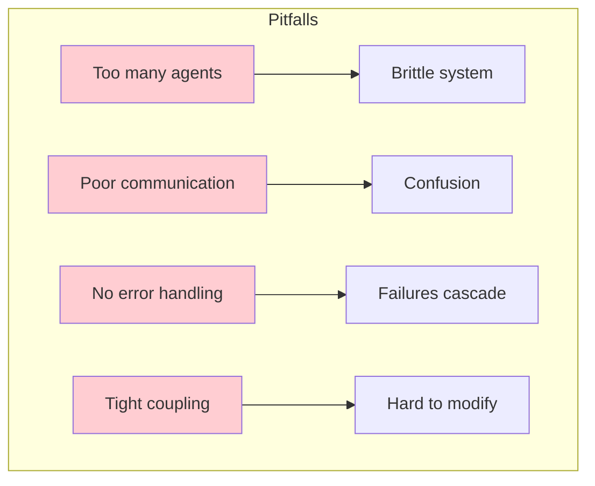
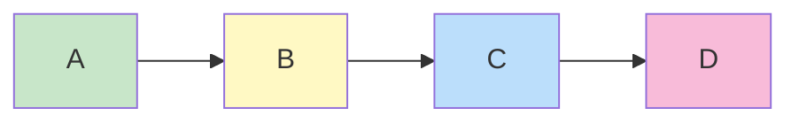
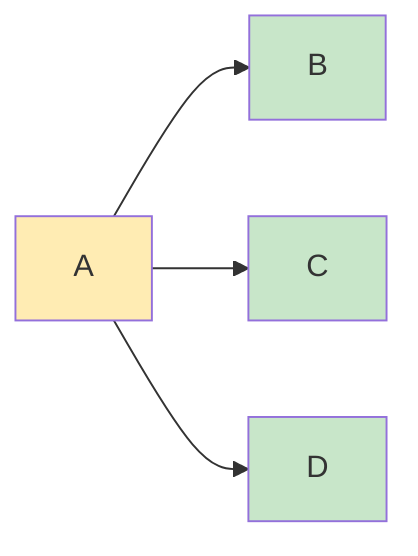
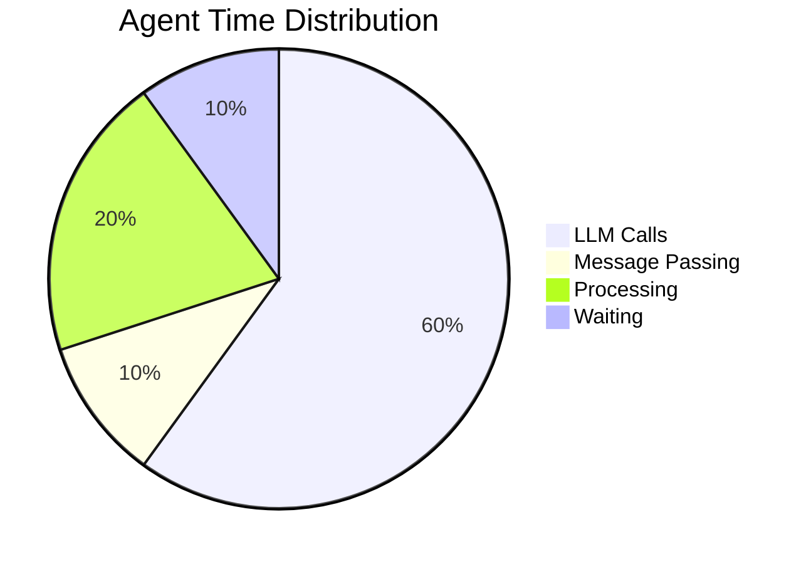

# Best Practices for Multi-Agent Systems

**Learning Objectives:**

- Identify common pitfalls in multi-agent design
- Choose appropriate communication patterns
- Build robust, maintainable multi-agent systems

## Common Pitfalls

Before learning best practices, be aware of these common mistakes:



:::warning Pitfall Checklist

- [ ] More than 5 agents in initial design?
- [ ] Agents sharing too much state?
- [ ] No clear failure handling?
- [ ] Hard-coded agent assignments?
:::

## Design Guidelines

### 1. Start Simple

```python
# Good: Simple 2-3 agent system
researcher = Researcher()
writer = Writer()

# Avoid: Too many agents initially
agents = [a1, a2, a3, a4, a5, a6, a7]  # Too complex!
```

**Rule of thumb:** Start with 2-3 agents, add more only when necessary.

### 2. Clear Communication Protocols

Define message types explicitly:

```python
class MessageType(Enum):
    REQUEST = "request"
    RESPONSE = "response"
    FEEDBACK = "feedback"
    ESCALATE = "escalate"

# Each message has a clear purpose
```

### 3. Fail Gracefully

```python
def process_with_retry(agent: Agent, task: str, max_retries: int = 3):
    """Process with automatic retry on failure."""
    for attempt in range(max_retries):
        try:
            return agent.process(task)
        except Exception as e:
            if attempt == max_retries - 1:
                raise  # Re-raise on final attempt
            log.warning(f"Attempt {attempt + 1} failed: {e}")
            time.sleep(2 ** attempt)  # Exponential backoff
```

### 4. Decouple Agents

```python
# Good: Agents communicate through messages
agent_a.send(agent_b, MessageType.REQUEST, task)

# Avoid: Direct function calls
agent_b.process(task)  # Tight coupling!
```

## Communication Patterns

### Pattern 1: Direct Messaging

Best for: Simple workflows with clear hand-offs



```python
# Simple, linear communication
researcher.send(planner, MessageType.FINDINGS, data)
planner.send(writer, MessageType.OUTLINE, outline)
```

### Pattern 2: Broadcast

Best for: Multiple agents need the same information



```python
# One agent informs multiple agents
supervisor.broadcast([
    agent1, agent2, agent3
], MessageType.UPDATE, context)
```

### Pattern 3: Request-Response

Best for: Agents that need information on-demand

```mermaid
sequenceDiagram
    A->>B: Request information
    B-->>A: Response

    style A fill:#bbdefb
    style B fill:#fff3e0
```

```python
# Agent requests and waits for response
response = await agent.request(
    from_agent=query_agent,
    message=query,
    timeout=30
)
```

## Error Handling Strategies

| Strategy | Use Case | Example |
|----------|----------|---------|
| **Retry** | Transient failures | Network timeouts |
| **Fallback** | Primary agent unavailable | Use backup agent |
| **Escalate** | Complex failures | Human intervention |
| **Circuit Breaker** | Repeated failures | Pause agent, alert |

```python
class CircuitBreaker:
    """Prevents cascade failures."""

    def __init__(self, failure_threshold: int = 5):
        self.failure_count = 0
        self.threshold = failure_threshold
        self.is_open = False

    def call(self, func, *args, **kwargs):
        if self.is_open:
            raise CircuitOpenError("Circuit is open")
        try:
            result = func(*args, **kwargs)
            self.failure_count = 0
            return result
        except Exception:
            self.failure_count += 1
            if self.failure_count >= self.threshold:
                self.is_open = True
            raise
```

## Testing Multi-Agent Systems

### Unit Tests per Agent

```python
def test_researcher():
    researcher = Researcher()
    result = researcher.research("Python")
    assert "programming" in result.lower()
    assert len(result) > 100
```

### Integration Tests

```python
def test_team_workflow():
    team = MultiAgentTeam()
    article = team.run("Climate Change")
    assert len(article) > 500
    assert "climate" in article.lower()
```

### Mock Communication

```python
from unittest.mock import Mock

def test_with_mocked_agent():
    mock_agent = Mock()
    mock_agent.receive.return_value = None

    sender = Agent("Sender")
    sender.send(mock_agent, MessageType.REQUEST, "test")

    mock_agent.receive.assert_called_once()
```

## Performance Considerations



### Optimization Tips

1. **Batch requests** - Group similar tasks
2. **Cache responses** - Avoid redundant LLM calls
3. **Parallel execution** - Run independent agents simultaneously
4. **Stream responses** - Show progress as agents work

```python
async def run_parallel(agents: List[Agent], task: str):
    """Run multiple agents in parallel."""
    tasks = [agent.process_async(task) for agent in agents]
    return await asyncio.gather(*tasks, return_exceptions=True)
```

## Security Considerations

:::danger Security Checklist

- [ ] Validate all inputs from agents
- [ ] Limit agent privileges (principle of least privilege)
- [ ] Audit agent-to-agent communication
- [ ] Protect API keys and sensitive data
- [ ] Implement rate limiting
:::

```python
# Validate incoming messages
def receive(self, message: Message):
    if not message.sender in self.trusted_agents:
        raise SecurityError(f"Untrusted sender: {message.sender}")
    # ... rest of receive logic
```

## Monitoring and Observability

Track key metrics:

```python
class MetricsCollector:
    """Collect metrics for monitoring."""

    def __init__(self):
        self.latencies = []
        self.successes = 0
        self.failures = 0

    def record_execution(self, agent: str, duration: float, success: bool):
        self.latencies.append((agent, duration))
        if success:
            self.successes += 1
        else:
            self.failures += 1

    def get_summary(self) -> dict:
        return {
            "total_runs": self.successes + self.failures,
            "success_rate": self.successes / (self.successes + self.failures),
            "avg_latency": sum(d for _, d in self.latencies) / len(self.latencies)
        }
```

## Summary

### Best Practices Summary

| Practice | Reason |
|----------|--------|
| Start with 2-3 agents | Complexity grows non-linearly |
| Define clear protocols | Prevents confusion |
| Handle failures gracefully | Robustness |
| Decouple agents | Maintainability |

:::success Key Takeaways

1. Start simple, add complexity only when needed
2. Design clear communication protocols
3. Build robust error handling from the start
4. Test each agent independently and as a team
5. Monitor performance and failures
:::

---

**Previous:** [Working Example](./example) | **Next:** [Exercises](./exercises) →
