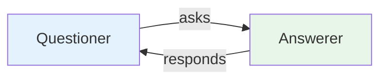
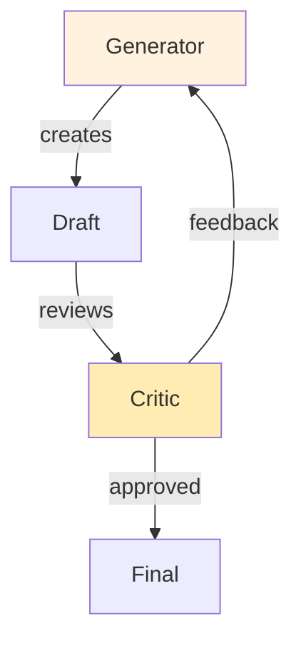
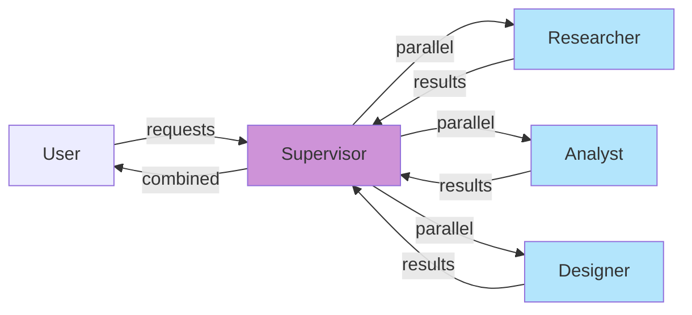

# Hands-On Exercises

Practice building multi-agent systems with these exercises.

---

## Exercise 1: Two-Agent Conversation (Beginner)

**Goal:** Build a simple two-agent system where agents exchange messages.

### Requirements

Create a system with:
- A **Questioner** agent that asks questions
- An **Answerer** agent that responds



### Starter Code

```python
class Questioner(Agent):
    def ask(self, topic: str) -> str:
        prompt = f"Ask an interesting question about: {topic}"
        return self.think(prompt)

class Answerer(Agent):
    def answer(self, question: str) -> str:
        prompt = f"Provide a thoughtful answer to: {question}"
        return self.think(prompt)

# Run the conversation
questioner = Questioner()
answerer = Answerer()

question = questioner.ask("artificial intelligence")
answer = answerer.answer(question)
print(f"Q: {question}\nA: {answer}")
```

### Deliverable

Run the conversation and capture the output. Try 3 different topics.

---

## Exercise 2: Critic-Review Loop (Beginner)

**Goal:** Build a supervisor-worker pattern where one agent critiques another's work.

### Requirements

- A **Generator** agent creates content
- A **Critic** agent reviews and provides feedback
- Loop until the critic approves



### Starter Code

```python
class Generator(Agent):
    def generate(self, topic: str) -> str:
        prompt = f"Write a short paragraph about: {topic}"
        return self.think(prompt)


class Critic(Agent):
    def critique(self, draft: str) -> tuple[bool, str]:
        prompt = f"""
        Review this text:
        {draft}

        Respond with:
        APPROVED if the text is good
        REVISION_NEEDED: [specific feedback] if improvements needed
        """
        response = self.think(prompt)
        if response.startswith("APPROVED"):
            return True, response
        return False, response.replace("REVISION_NEEDED:", "").strip()


def run_critique_loop(topic: str, max_iterations: int = 3) -> str:
    generator = Generator()
    critic = Critic()

    for i in range(max_iterations):
        draft = generator.generate(topic)
        approved, feedback = critic.critique(draft)

        print(f"\nIteration {i + 1}:")
        print(f"Draft: {draft[:100]}...")
        print(f"Critic: {feedback[:100]}...")

        if approved:
            return draft

    return draft  # Return last draft even if not approved
```

### Deliverable

Run the critique loop and observe how the quality improves over iterations.

---

## Exercise 3: Parallel Agent Team (Intermediate)

**Goal:** Build a system where multiple agents work in parallel.

### Requirements

- 3 specialist agents working simultaneously
- Results combined into a final output



### Starter Code

```python
import asyncio
from typing import List

class ParallelTeam:
    """A team that runs agents in parallel."""

    def __init__(self, agents: List[Agent]):
        self.agents = agents

    async def run_all(self, task: str) -> List[str]:
        """Run all agents in parallel and collect results."""
        async def run_agent(agent: Agent):
            return await agent.process_async(task)

        tasks = [run_agent(agent) for agent in self.agents]
        results = await asyncio.gather(*tasks, return_exceptions=True)

        # Handle exceptions
        return [r if not isinstance(r, Exception) else str(r) for r in results]


# Example: Three specialists
class Researcher(Agent):
    async def process_async(self, topic: str) -> str:
        return f"Research on {topic}: Key facts and sources"


class Analyst(Agent):
    async def process_async(self, topic: str) -> str:
        return f"Analysis of {topic}: Trends and insights"


class Designer(Agent):
    async def process_async(self, topic: str) -> str:
        return f"Design considerations for {topic}: UX and visual"


async def main():
    team = ParallelTeam([
        Researcher(),
        Analyst(),
        Designer()
    ])

    results = await team.run_all("sustainable energy")
    for i, result in enumerate(results):
        print(f"Agent {i + 1}: {result}")


# Run: asyncio.run(main())
```

### Deliverable

Add a combiner agent that synthesizes the parallel results into a unified output.

---

## Exercise 4: Custom Architecture (Advanced)

**Goal:** Design and implement a custom multi-agent architecture for a real-world problem.

### Choose Your Scenario

| Domain | Agents | Workflow |
|--------|--------|----------|
| **Content Pipeline** | Editor, SEO Specialist, Proofreader | Write → Optimize → Polish |
| **Customer Support** | Triage, Technical, Billing, Escalation | Route → Resolve → Follow-up |
| **Code Review** | Linter, Security, Performance, Style | Check all → Report → Suggest fixes |

### Requirements

1. Define agent roles and goals
2. Choose an architectural pattern
3. Implement message types
4. Handle errors gracefully
5. Write unit tests

### Template

```python
# YOUR_CUSTOM_SYSTEM.py

# 1. Define your agents
class Agent1(Agent):
    """Specialist for [role]."""
    def __init__(self):
        super().__init__(
            name="[Name]",
            role="[Role description]",
            goal="[Goal statement]"
        )

    def process(self, input_data):
        # Your implementation
        pass


# 2. Define your workflow
class CustomWorkflow:
    def __init__(self):
        self.agents = [
            Agent1(),
            Agent2(),
            # ... add more agents
        ]

    def run(self, input_data):
        # Your workflow logic
        pass


# 3. Test your system
if __name__ == "__main__":
    workflow = CustomWorkflow()
    result = workflow.run("your input")
    print(result)
```

### Deliverable

Submit a working system with:
- [ ] All agent classes implemented
- [ ] Clear communication flow
- [ ] Error handling
- [ ] Unit tests for each agent
- [ ] Example usage with output

---

## Exercise Solutions

:::info
Solutions are available in the `solutions/` directory.

Compare your implementation with the reference solutions after completing exercises.
:::

---

## Additional Resources

- [Official OpenAI API Documentation](https://platform.openai.com/docs)
- [LangChain Multi-Agent Documentation](https://python.langchain.com/docs/modules/agents/)
- [AutoGPT GitHub](https://github.com/Significant-Gravitas/AutoGPT)

---

**Previous:** [Best Practices](./best-practices) | **Next:** [Summary](./summary) →
