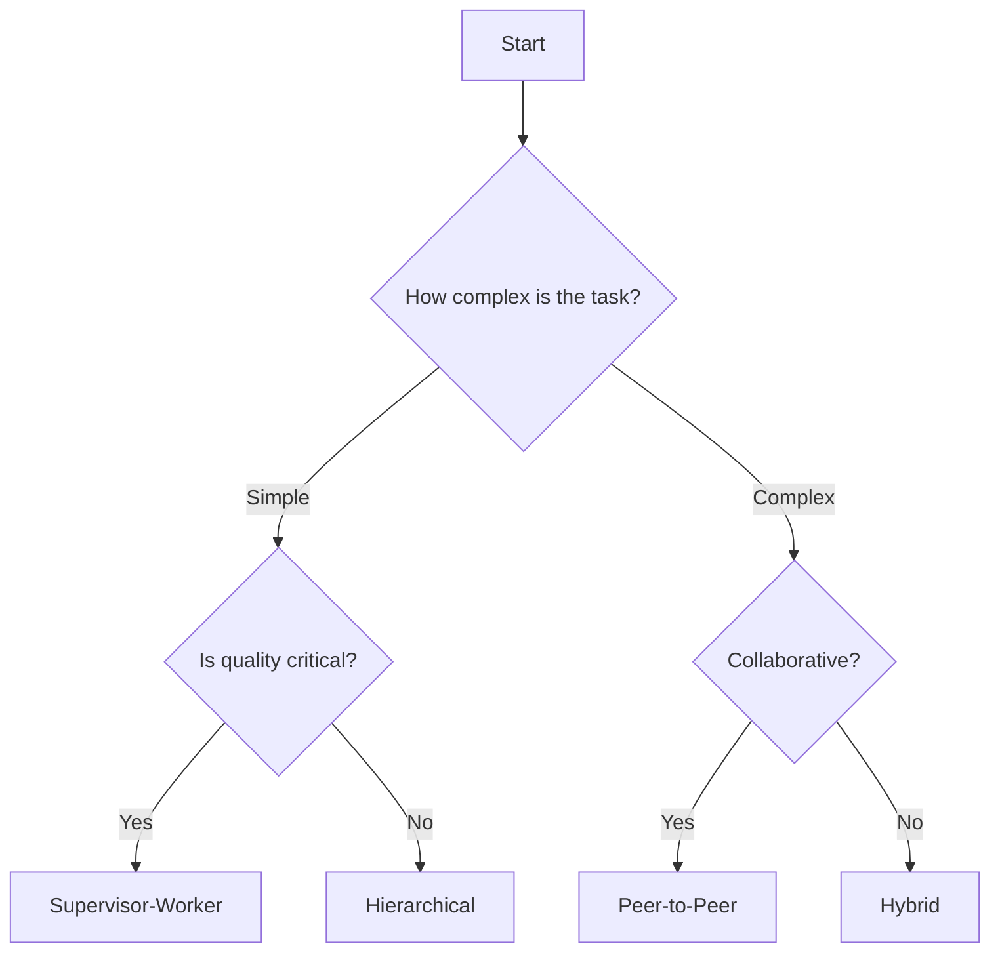

# Chapter Summary

## Key Takeaways

Congratulations on completing this chapter! Here's what you learned:

### Multi-Agent Systems Overview

| Concept | Description |
|---------|-------------|
| **Multi-Agent System** | A collection of autonomous agents working together |
| **Agent** | An autonomous entity that perceives, decides, and acts |
| **Coordination** | How agents align their actions and share information |
| **Communication** | The protocols agents use to exchange messages |

### Architectural Patterns

| Pattern | Best For | Trade-off |
|---------|----------|-----------|
| **Hierarchical** | Complex workflows | Rigid structure |
| **Peer-to-Peer** | Collaborative tasks | Unpredictable |
| **Supervisor-Worker** | Quality control | Bottleneck risk |

### Best Practices

1. **Start simple** - Begin with 2-3 agents
2. **Clear protocols** - Define message types explicitly
3. **Fail gracefully** - Implement retry and fallback strategies
4. **Decouple agents** - Use message passing, not direct calls
5. **Test thoroughly** - Unit tests + integration tests

---

## Self-Check

Verify your understanding:

- [ ] Can you explain what a multi-agent system is?
- [ ] Can you name 3 architectural patterns?
- [ ] Can you choose an architecture for a given use case?
- [ ] Can you implement a basic multi-agent system?
- [ ] Can you identify and avoid common pitfalls?

---

## Chapter Review Questions

1. **What are the key characteristics of an agent?**
2. **Compare and contrast centralized vs. decentralized coordination.**
3. **When would you use the supervisor-worker pattern?**
4. **How do you handle failures in a multi-agent system?**
5. **What are the trade-offs of adding more agents?**

---

## Glossary

| Term | Definition |
|------|------------|
| **Agent** | An autonomous entity capable of perception, reasoning, and action |
| **Autonomy** | The ability to operate independently without constant control |
| **Centralized Coordination** | A single coordinator directs all agent actions |
| **Decentralized Coordination** | Agents communicate directly without a central controller |
| **Message** | A structured communication between agents |
| **Multi-Agent System** | A system with multiple interacting autonomous agents |
| **Orchestration** | Coordinating multiple agents toward a common goal |
| **Task Decomposition** | Breaking complex goals into smaller sub-tasks |
| **Protocol** | A set of rules governing agent communication |

---

## Next Steps

Now that you've completed this chapter, consider:

- **Build Your Own System** - Apply what you learned to a real problem
- **Explore Advanced Topics** - Study agent learning, memory, and adaptation
- **Join the Community** - Discuss with other practitioners

---

## Quick Reference

### Code Template

```python
# Simple multi-agent system template
from dataclasses import dataclass
from typing import List
from enum import Enum

class MessageType(Enum):
    REQUEST = "request"
    RESPONSE = "response"

@dataclass
class Message:
    sender: str
    recipient: str
    type: MessageType
    content: str

class Agent:
    def __init__(self, name: str, role: str):
        self.name = name
        self.role = role
        self.inbox = []

    def receive(self, message: Message):
        self.inbox.append(message)

    def send(self, recipient: 'Agent', msg_type: MessageType, content: str):
        message = Message(self.name, recipient.name, msg_type, content)
        recipient.receive(message)

# Use: Create agents, define their roles, implement communication
```

### Architecture Decision Tree



---

**Previous:** [Exercises](./exercises) | **[Back to Index](../../intro)**

---

*Chapter complete! You now have a solid foundation in multi-agent AI systems.*
