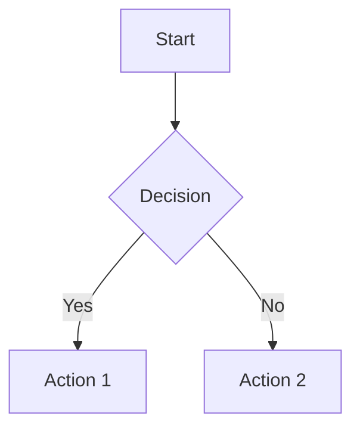

# Data Model: Docusaurus Documentation

## Markdown Document Schema

Each documentation page is a Markdown (`.md`) or MDX (`.mdx`) file with front matter:

```yaml
---
id: page-id              # Unique identifier (required, used for linking)
title: Page Title        # Display title (defaults to first H1 if omitted)
sidebar_label: Short     # Alternate label for sidebar (defaults to title)
sidebar_position: 4      # Numeric position within category
toc_min_heading_level: 2 # Minimum heading level for TOC (default: 2)
toc_max_heading_level: 3 # Maximum heading level for TOC (default: 3)
draft: false             # Set true to exclude from build
---
```

## Sidebar Category Configuration

Each directory can contain a `_category_.json` file to configure sidebar behavior:

```json
{
  "label": "Tutorial",           # Display name in sidebar
  "position": 2,                 # Numeric order within parent
  "collapsible": true,           # Allow collapsing (default: true)
  "collapsed": false,            # Start expanded (default: true for non-root)
  "link": {
    "type": "generated-index",   # Auto-generate index page
    "title": "Tutorial Overview",
    "description": "Learn the basics"
  }
}
```

## Directory Structure Model

```
docs/
├── _category_.json              # Root category config
├── intro.md                     # Standalone page
├── getting-started.md           # Standalone page
└── tutorial-basics/
    ├── _category_.json          # Tutorial category config
    ├── index.md                 # Category landing page
    ├── installation.md
    └── configuration.md
```

### Relationship Rules

- Files at root level appear in sidebar root (or custom category)
- Subdirectories create collapsible categories
- `_category_.json` in a directory configures that category
- Files without `_category_.json` appear in parent category
- `index.md` or `README.md` serves as category landing page

## Component Model (MDX)

Custom React components follow this pattern:

```jsx
// src/components/InteractiveDiagram.jsx
import React from 'react';

export default function InteractiveDiagram({ title, children }) {
  return (
    <div className="interactive-diagram">
      <h3>{title}</h3>
      {children}
    </div>
  );
}
```

**Usage in MDX**:
```markdown
import InteractiveDiagram from '@site/src/components/InteractiveDiagram';

<InteractiveDiagram title="System Flow">
  
</InteractiveDiagram>
```

## Mermaid Diagram Schema

Mermaid diagrams use fenced code blocks:

````markdown

````

**Supported Diagram Types**:
- `graph` / `flowchart` - Flow diagrams
- `sequenceDiagram` - Sequence diagrams
- `stateDiagram` - State machines
- `classDiagram` - Class relationships
- `pie` - Pie charts
- `gantt` - Project timelines
- `journey` - User journeys
- `requirementDiagram` - Requirements
- `gitGraph` - Git history visualization

## Configuration Schema

**docusaurus.config.js**:

```javascript
export default {
  title: 'Site Title',
  tagline: 'Tagline',
  url: 'https://your-site.com',
  baseUrl: '/',
  onBrokenLinks: 'throw',
  onBrokenMarkdownLinks: 'warn',

  markdown: {
    mermaid: true,  // Enable Mermaid
  },

  themes: ['@docusaurus/theme-mermaid'],

  themeConfig: {
    navbar: {
      title: 'Site Name',
      items: [
        { type: 'doc', docId: 'intro', position: 'left', label: 'Docs' },
        { href: 'https://github.com/...', position: 'right', label: 'GitHub' },
      ],
    },
    mermaid: {
      theme: { light: 'neutral', dark: 'forest' },
    },
  },
};
```

## Sidebar Schema

**sidebars.js**:

```javascript
const sidebars = {
  tutorialSidebar: [
    { type: 'autogenerated', dirName: '.' },
  ],
};

export default sidebars;
```

### Sidebar Item Types

| Type | Description | Example |
|------|-------------|---------|
| `doc` | Link to a doc page | `{ type: 'doc', docId: 'intro' }` |
| `link` | External link | `{ type: 'link', href: 'https://...', label: 'Ext' }` |
| `category` | Collapsible section | `{ type: 'category', label: 'Section', items: [...] }` |
| `autogenerated` | Auto-generate from directory | `{ type: 'autogenerated', dirName: 'tutorial' }` |
| `html` | Custom HTML | `{ type: 'html', value: '<div>...</div>' }` |
