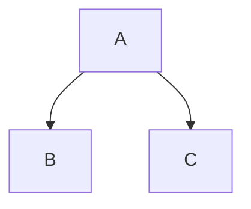

# Implementation Plan: Docusaurus Documentation Setup

**Branch**: `001-docusaurus-docs` | **Date**: 2025-12-29 | **Spec**: [link](specs/001-docusaurus-docs/spec.md)
**Input**: Feature specification from `/specs/001-docusaurus-docs/spec.md`

## Summary

This plan outlines the setup of a Docusaurus v3 documentation site with Markdown/MDX content, sidebar navigation, interactive React components, Mermaid diagram support, and table of contents. The documentation will be stored in the `docs/` directory at repository root, following Docusaurus best practices.

**Primary Requirement**: Create a modern, interactive documentation site using Docusaurus v3 with all requested features (sidebars, MDX, Mermaid, TOC).

**Technical Approach**: Initialize Docusaurus classic preset, configure required plugins for Mermaid and MDX, set up auto-generated sidebars, and customize theme for optimal readability.

## Technical Context

**Language/Version**: Node.js 20.0+
**Primary Dependencies**:
- `docusaurus` v3.9.2 (latest stable)
- `@docusaurus/theme-mermaid` for diagram support
- React 18 (bundled with Docusaurus)

**Storage**: Filesystem-based (`docs/` directory at repo root)
**Testing**: Manual browser testing, `npm run build` validation
**Target Platform**: Web (static site generation)
**Project Type**: Documentation site (single project)
**Performance Goals**: Static build with fast page loads, minimal bundle size
**Constraints**: Must use Docusaurus v3, Node.js 20+ required
**Scale/Scope**: Initial docs directory with 5-10 pages, expandable

## Constitution Check

*GATE: Must pass before Phase 0 research. Re-check after Phase 1 design.*

| Principle | Requirement | Status |
|-----------|-------------|--------|
| I. Readable Prose | Clear documentation with good structure | PASS - Docusaurus provides clean, readable typography |
| II. Code Examples | Functional examples with context | PASS - Will include runnable initialization commands |
| III. Modular Structure | Self-contained, independently valuable | PASS - Each doc page stands alone; sidebars enable navigation |
| IV. Consistent Voice | Unified tone across documentation | PASS - Theme enforces consistent styling |
| V. Progressive Complexity | Concepts introduced in order | PASS - Setup flows from basic to advanced features |
| VI. Actionable Learning | Takeaways and exercises | PASS - Quickstart guide provides hands-on steps |

**Result**: ✅ ALL GATES PASS - No violations detected

## Project Structure

### Documentation (this feature)

```text
specs/001-docusaurus-docs/
├── plan.md              # This file (/sp.plan command output)
├── research.md          # Phase 0 output (/sp.plan command)
├── data-model.md        # Phase 1 output (/sp.plan command)
├── quickstart.md        # Phase 1 output (/sp.plan command)
├── contracts/           # N/A - not applicable for docs
└── tasks.md             # Phase 2 output (/sp.tasks command - NOT created by /sp.plan)
```

### Source Code (repository root)

```text
# Docusaurus documentation project
docs/                    # Documentation markdown files (MDX supported)
├── intro.md             # Introduction page
├── tutorial-basics/     # Tutorial section
│   ├── _category_.json  # Sidebar category config
│   └── ...
├── tutorial-advanced/   # Advanced topics
└── _category_.json      # Root category config

blog/                    # Blog (optional, from classic preset)
src/
├── components/          # React components for MDX
├── css/                 # Custom CSS
└── pages/               # Custom pages

static/                  # Static assets (images, etc.)

docusaurus.config.js     # Docusaurus configuration
sidebars.js              # Sidebar navigation config
package.json             # Dependencies and scripts
```

**Structure Decision**: Using Docusaurus classic preset with auto-generated sidebars. The `docs/` directory at repo root stores all documentation. Custom React components go in `src/components/` for use in MDX files.

## Phase 0: Research Findings

### Docusaurus v3.9.2 Installation

**Decision**: Use `npx create-docusaurus@latest docs classic`

**Rationale**: The classic preset includes all required features (docs, blog, pages, dark mode) and is the most widely used configuration.

**Alternatives Considered**:
- `minimal` preset: Too basic, lacks features needed for sidebars and TOC
- Custom setup: More work, less maintainable

### Mermaid Diagrams

**Decision**: Install `@docusaurus/theme-mermaid` plugin

**Installation**:
```bash
npm install --save @docusaurus/theme-mermaid
```

**Configuration** (`docusaurus.config.js`):
```javascript
export default {
  markdown: {
    mermaid: true,
  },
  themes: ['@docusaurus/theme-mermaid'],
  themeConfig: {
    mermaid: {
      theme: { light: 'neutral', dark: 'forest' },
    },
  },
};
```

**Usage**:
````markdown

````

### Sidebar Configuration

**Decision**: Use auto-generated sidebars with category files

**Approach**: Docusaurus can auto-generate sidebars from directory structure using `sidebars.js`:

```javascript
// sidebars.js
const sidebars = {
  tutorialSidebar: [{type: 'autogenerated', dirName: '.'}],
};
```

**Categories**: Use `_category_.json` files to customize category labels and ordering:
```json
{
  "label": "Tutorial",
  "position": 2,
  "link": {
    "type": "generated-index"
  }
}
```

### Table of Contents

**Decision**: Use Docusaurus built-in TOC (enabled by default)

**Behavior**: Automatically shows on pages with 2+ headings. Customizable in front matter:
```markdown
---
toc_min_heading_level: 2
toc_max_heading_level: 3
---
```

### Interactive MDX

**Decision**: Use standard MDX with React components

**Setup**: Built into Docusaurus; no extra configuration needed. Import components directly in MDX:
```markdown
import MyComponent from '@site/src/components/MyComponent';

<MyComponent prop="value" />
```

## Phase 1: Design Artifacts

### Data Model

The documentation "data model" consists of markdown front matter and sidebar structure:

**Markdown Front Matter Schema**:
```yaml
---
id: page-id          # Unique identifier
title: Page Title    # Display title
sidebar_label: Alt   # Optional sidebar label
toc_min_heading_level: 2
toc_max_heading_level: 3
---
```

**Sidebar Structure**:
- Auto-generated from directory structure
- Category files (`_category_.json`) define order and labels
- Supports nested hierarchies of arbitrary depth

### Quickstart Guide

See `quickstart.md` for step-by-step setup instructions.

## Complexity Tracking

> No constitution violations detected. All features are within standard Docusaurus capabilities.

## Next Steps

Proceed to `/sp.tasks` to generate implementation tasks based on this plan.
