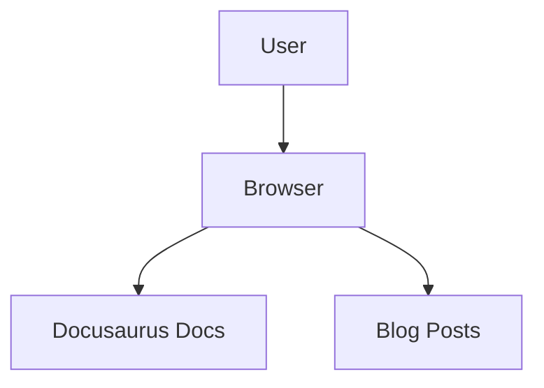

# Quickstart: Docusaurus Documentation

## Prerequisites

- Node.js version 20.0 or higher
- npm, Yarn, pnpm, or Bun package manager

Check your Node version:
```bash
node -v
```

## Step 1: Initialize Docusaurus

Run the following command in your repository root:

```bash
npx create-docusaurus@latest docs classic
```

This creates a `docs/` directory with the classic Docusaurus preset.

**Expected output**:
```
[INFO] Creating new Docusaurus project...
[INFO] Installing dependencies...
[SUCCESS] Created Docusaurus project.
```

## Step 2: Verify Installation

Navigate to the docs directory and start the development server:

```bash
cd docs
npm run start
```

Your documentation site should now be running at `http://localhost:3000`.

**Success criteria**:
- [ ] Local server starts without errors
- [ ] Homepage displays with Docusaurus branding
- [ ] Sidebar navigation appears on docs pages

## Step 3: Install Mermaid Plugin

Install the Mermaid theme plugin:

```bash
npm install --save @docusaurus/theme-mermaid
```

## Step 4: Configure Docusaurus

Edit `docusaurus.config.js` to enable Mermaid:

```javascript
// docusaurus.config.js
export default {
  // ... existing config ...

  markdown: {
    mermaid: true,
  },
  themes: ['@docusaurus/theme-mermaid'],

  themeConfig: {
    // ... existing theme config ...

    mermaid: {
      theme: { light: 'neutral', dark: 'forest' },
    },
  },
};
```

## Step 5: Configure Sidebars

Docusaurus auto-generates sidebars from directory structure. The default `sidebars.js` works out of the box:

```javascript
// sidebars.js
const sidebars = {
  tutorialSidebar: [{ type: 'autogenerated', dirName: '.' }],
};

export default sidebars;
```

### Customizing Categories

Create `_category_.json` files in docs directories:

```json
{
  "label": "Tutorial",
  "position": 2,
  "link": {
    "type": "generated-index",
    "title": "Tutorial Overview"
  }
}
```

## Step 6: Create Your First Doc

Create `docs/intro.md`:

```markdown
---
id: intro
title: Introduction
sidebar_label: Welcome
---

# Introduction

Welcome to our documentation!

## Getting Started

To get started, see [Installation](/tutorial-basics/installation).

## Features

- Markdown and MDX support
- Mermaid diagrams
- Interactive React components
```

## Step 7: Add a Mermaid Diagram

Add diagrams to any markdown file:

````markdown
# Architecture Overview


````

## Step 8: Add Interactive Components

Create a component in `src/components/Hero.jsx`:

```jsx
export default function Hero({ title }) {
  return (
    <div style={{ padding: '2rem', background: '#f0f0f0' }}>
      <h1>{title}</h1>
    </div>
  );
}
```

Use it in any MDX file:

```markdown
import Hero from '@site/src/components/Hero';

<Hero title="Welcome to Our Docs" />
```

## Step 9: Build for Production

Generate the static site:

```bash
npm run build
```

Output is in the `build/` directory, ready to deploy to any static host.

**Validate the build**:
```bash
# Test locally
npm run serve
```

## Directory Structure

After setup, your project structure:

```
.
├── docs/
│   ├── _category_.json
│   ├── intro.md
│   ├── tutorial-basics/
│   │   ├── _category_.json
│   │   └── installation.md
│   └── tutorial-advanced/
├── blog/
├── src/
│   ├── components/
│   └── pages/
├── static/
├── docusaurus.config.js
├── sidebars.js
└── package.json
```

## Next Steps

1. **Customize the theme** - Edit `src/css/custom.css`
2. **Add more pages** - Create `.md` or `.mdx` files in `docs/`
3. **Deploy** - Push to GitHub and connect to Vercel, Netlify, or GitHub Pages

## Troubleshooting

| Issue | Solution |
|-------|----------|
| Node version too old | Install Node.js 20+ from nodejs.org |
| Port 3000 in use | Run `npm run start -- --port 3001` |
| Build fails | Check for missing dependencies, run `npm install` |
| Mermaid not rendering | Verify `mermaid: true` in config and theme installed |
| Sidebar missing | Ensure `sidebars.js` exports valid configuration |
